# Customizing Arcs

With minimal effort, arcs can be altered to be very different in visual style!

First, create a new Niagara System:
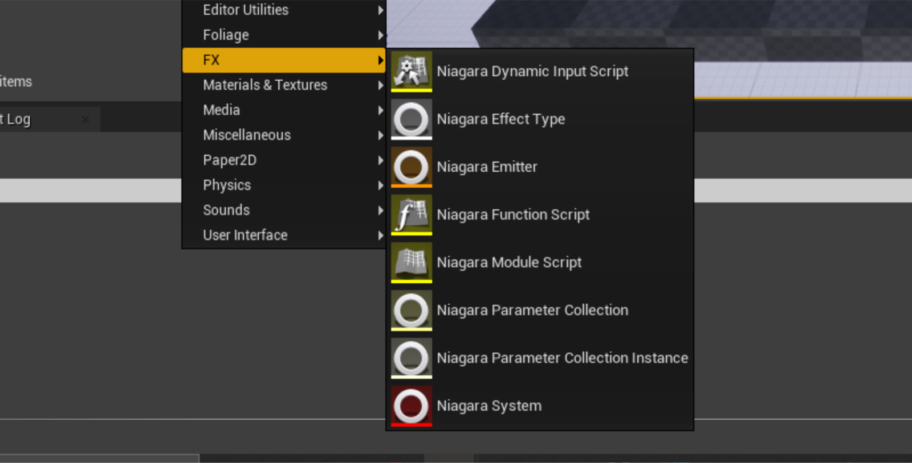

Next, select `New system from template`:
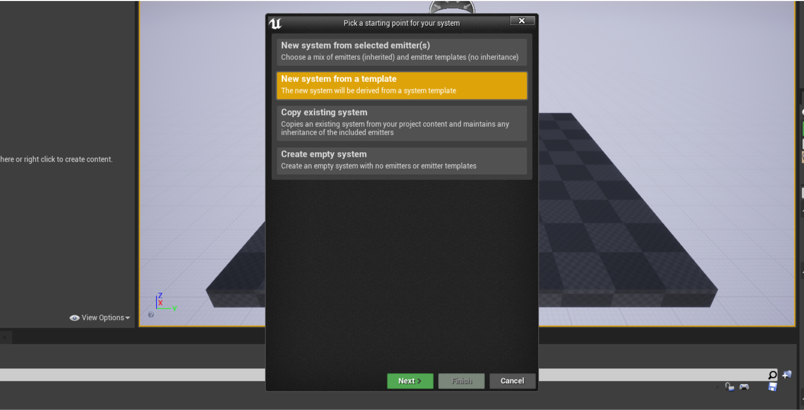

Choose `FX Arc`:
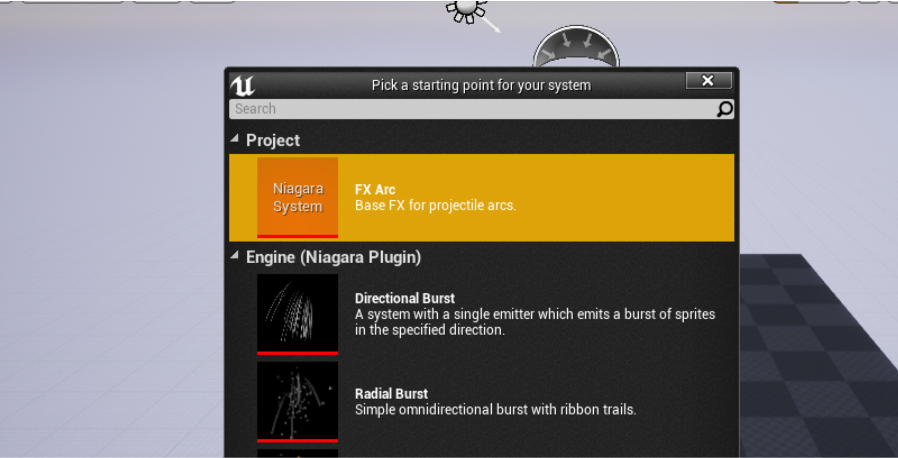

Once created, your new particle system consists of 2 main elements: the **Arc** and the **ProjectileTarget**. Both can be modified like any particle.
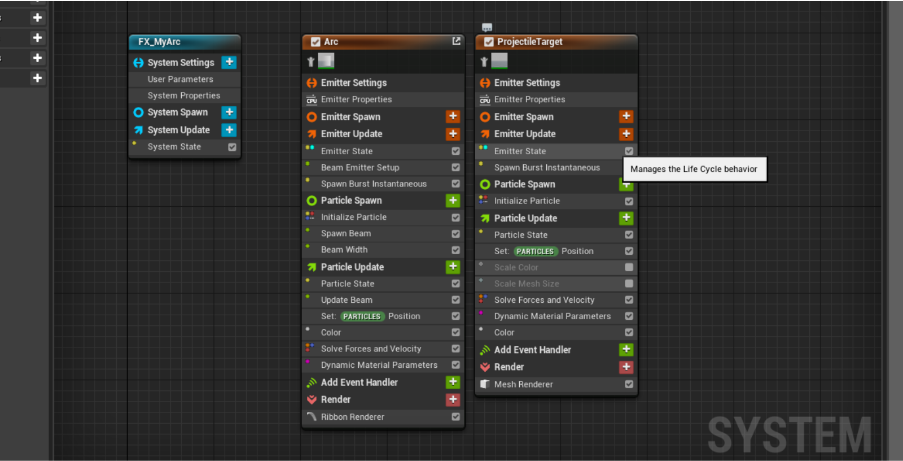

By now, you may be noticing only an arc in the viewport! This is normal, because the arc need geometry behind to render. Let's get our preview area setup properly. Go to `Window/Preview Scene Settings`, and find the window this summons.
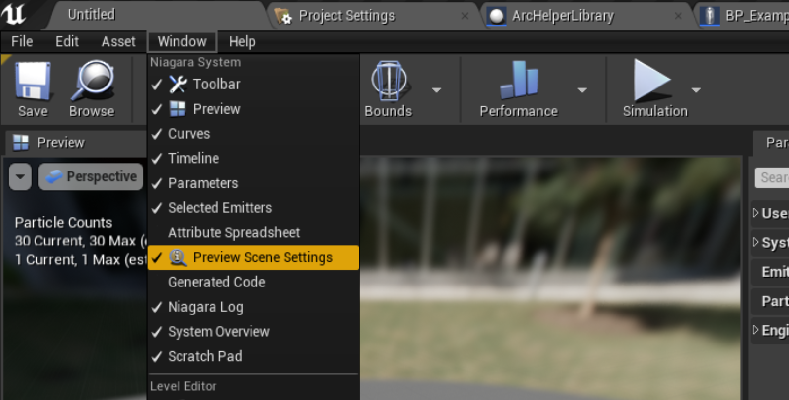

Next, search for `Show Floor`, and set it to true.
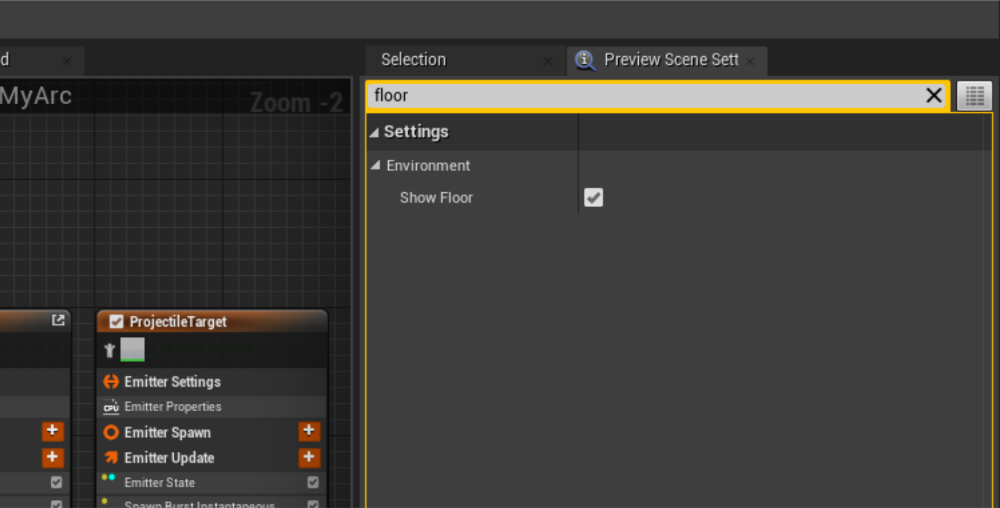

Now our particle should be rendering properly in the editor!
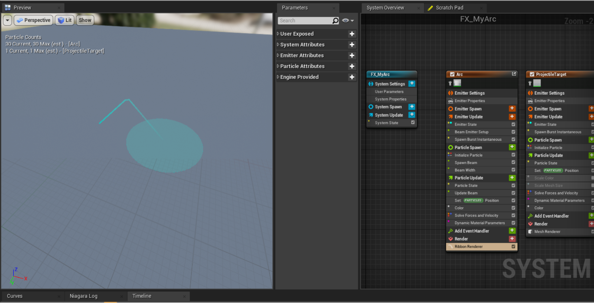

Now we need to get into the materials! There are two main materials for the arcs, with different customization options: `M_ArcBase` and `M_GoalSphere`. 

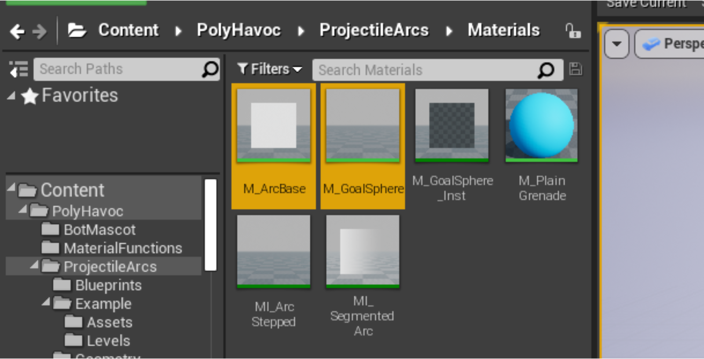

**M_ArcBase:**
  _Handles the actual path rendering._

**M_GoalSphere:** _Projects a sphere onto the world, and handles the impact point of the arc._

To modify the look of your arc, you'll need to make a material instance of either (or both!).
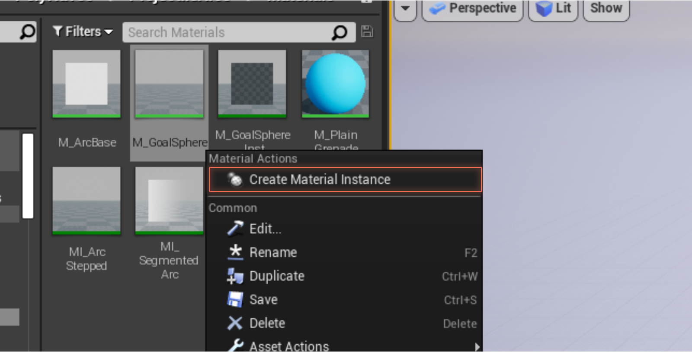

After modifying the material to have gaps, outlines, gradients, etc... Make sure to set them in your new Niagara System! To change the material, select the `Ribbon Renderer` or the `Mesh Renderer` for each respective effect. Then locate the material section, and assign your new material(s).

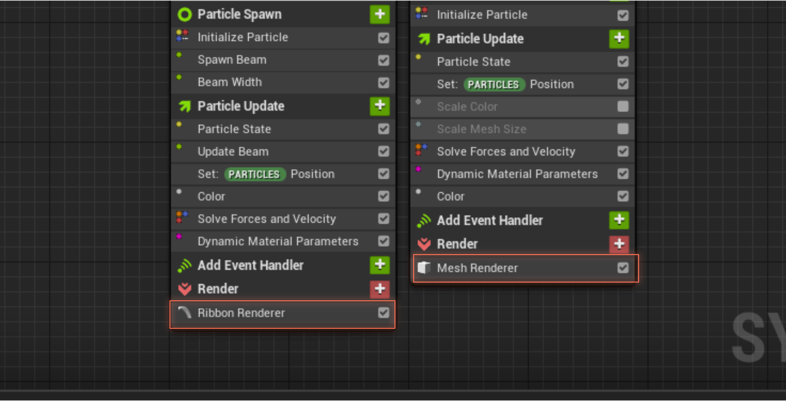

Along with material effects, you can also change User Settings for the particle system here, to change the defaults of the system. From `User Parameters` you can change the color, radius and debug the points for the arc. 

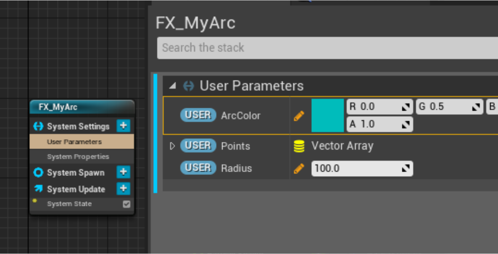

You can also change the color and radius from `Update Arc` nodes at runtime!

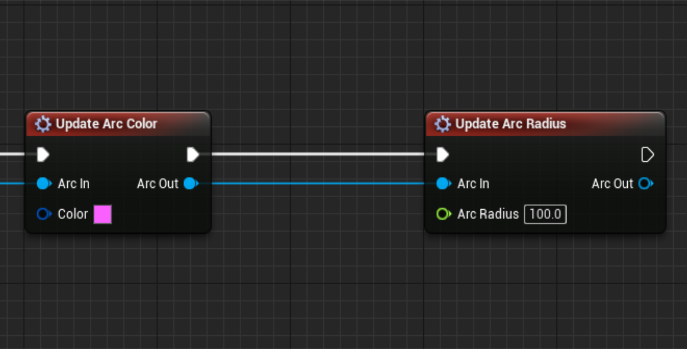

You can even add nodes to the arc (like the jitter node) to make completely new effects!

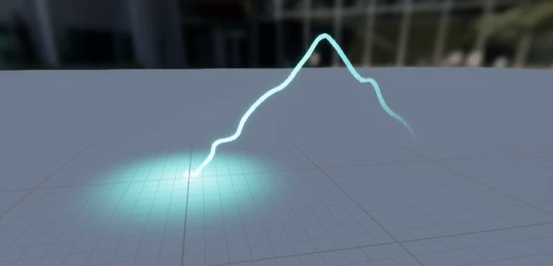

To use your new effect, simply choose it for the override effect in your `CreateArc` node!

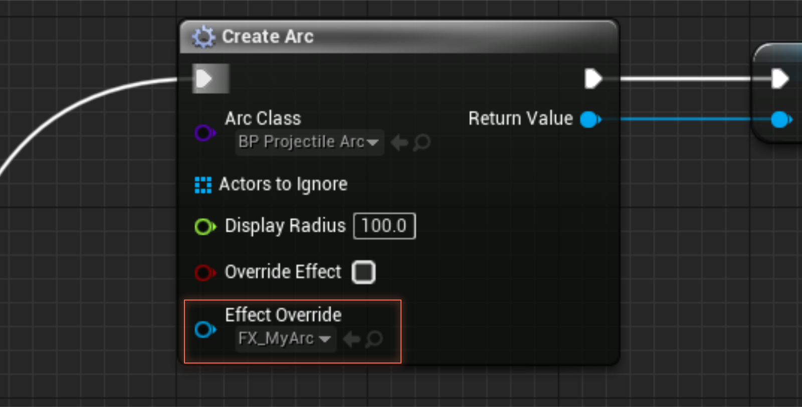