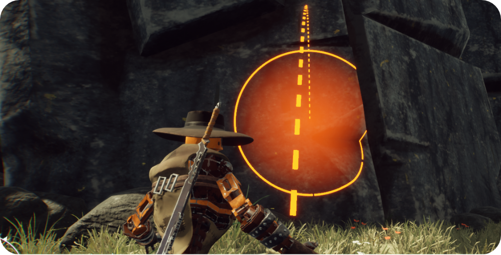
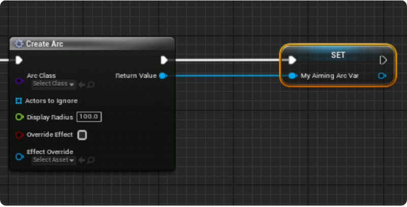
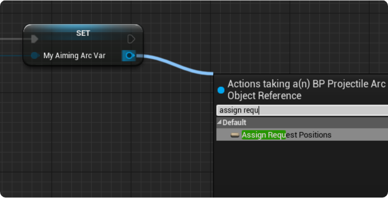
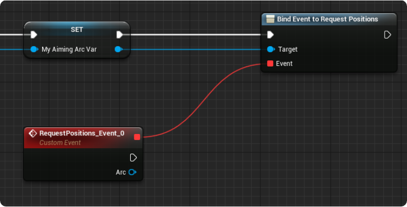
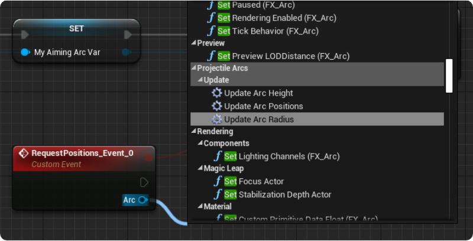
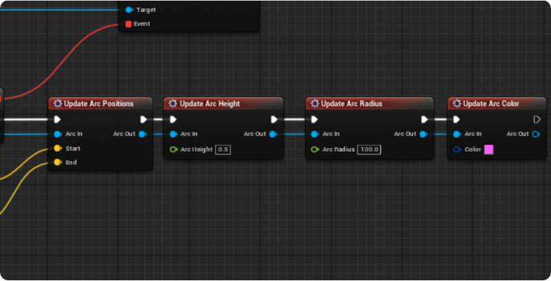
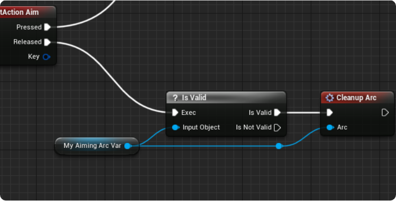
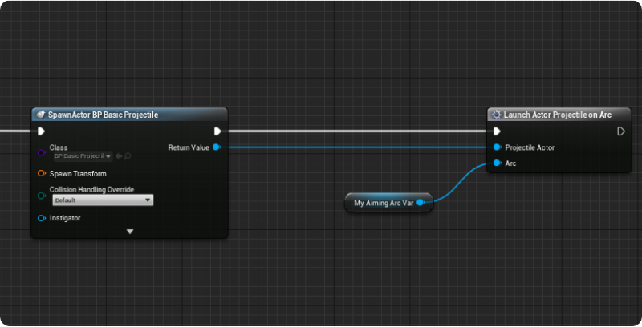
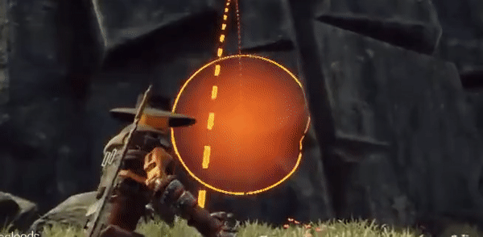

# Getting Started

_Projectile Arcs in_ ***[Rustwalker Legends](https://rustwalkerlegends.com)***

Implementing Projectile Arcs into your project is a relatively quick process, and can be customized to look how you want.

## Creating your first arc
First, find the node where you'll be creating the arcs from. In this situation, I'll be creating an arc on the aim key down _(Right Mouse Button)_. From the on pressed node, drag off and search for `CreateArc`. This arc will need to be stored for later use, so put that into a new variable.

## Event Binding
Next up, the arc needs to be updated. This is done with an event dispatcher called `Request Positions`. If you're not familiar with **[Event Dispatchers](https://docs.unrealengine.com/en-US/ProgrammingAndScripting/Blueprints/UserGuide/EventDispatcher/index.html)** don't worry, you won't have to deal with them much at all here. Just drag off of the blue pin of the new arc, and search for `Assign Request Positions`.

This will create a new event for us, bound to the event dispatcher `RequestPositions` which will be called **every frame of the arcs existence**.

## Updating the Arc

From this new node, you'll be able to update the arcs start, end, color, height, etc... every frame. Just search for `Update Arc` while dragging from the blue pin.

These macros were design to chain together, making it easy to quickly update whatever parts needed on the arc without making the graph messy. Just take the return node and connect to another set.

You can call as many of these as necessary, or just the `UpdateArcPositions`.

Next, we need to have the arc clean up after use. When your done with the arc, just call `CleanupArc`, and it'll be removed from the game.

## Launching Projectiles

Now, you probably want to throw something. I do too, but that could be because I've been writing documentation. To make a projectile fly, create an actor blueprint with a **[Projectile Movement Component](https://docs.unrealengine.com/en-US/Basics/Components/Movement/index.html)**. Make sure the root component has collision, and spawn in an actor from the blueprint you created your arc in. Next, it's just a matter of calling `LaunchActorProjectileOnArc` (or `LaunchProjectileOnArc` if you don't want to use the actor reference).

## Wrapping Up
You should now have a thrown projectile, that goes where you point your arc!

Next, we'll go over how to make a new arc that looks unique for your game!